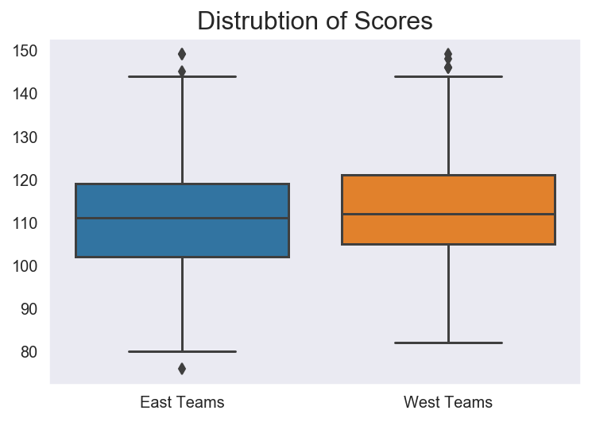
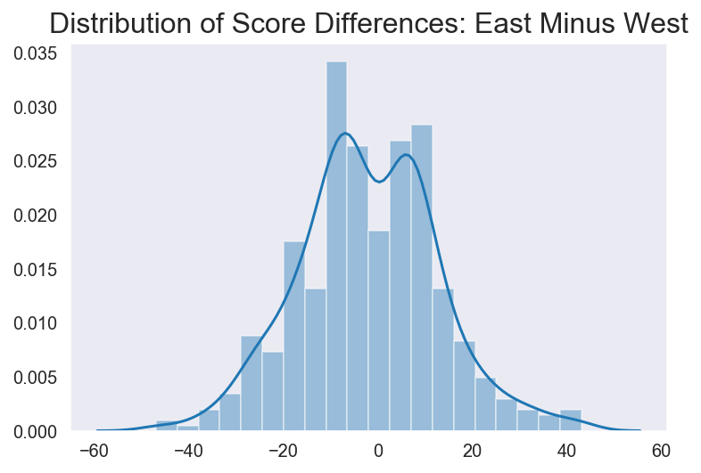
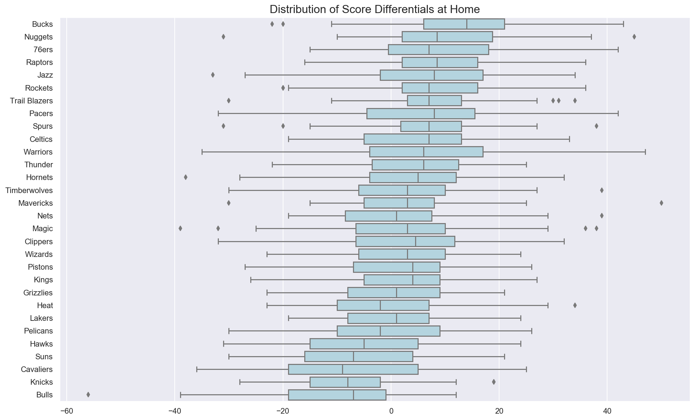

# NBA Project

## Table of contents

* [About the Project](#about-the-project)
* [Obtain Data](#obtain-data)
* [Scrub and Explore Data](#scrub-and-explore-data)
* [Hypotheses Tests](#hypotheses-tests)
* [Future Work](#future-work)
* [Contact](#contact)

## About the Project

Members: Aneesh Kodali, Sharon Kwak

This project was completed as part of Flatiron School's Data Science Fellowship program. Using an [API](https://www.balldontlie.io/#games), we obtained NBA game data for the 2018-2019 season and conducted two hypotheses tests to determine:
1. Which conference was better: East or West?
2. Which team has a home court advantage?

The project contains the following
- *NBA Project.ipynb*: technical notebook
- *obtainData.py*: contains functions to make API request and to create necessary dataframes for our tests
- *visualizations.py*: contains functions that produce graphs to illustrate our tests.
- *img*: folder with images

## Obtain Data

Given a season (in this case, 2018-2019), our function grabs all games in that season.

## Scrub and Explore Data

Not much data cleaning needed. The *home_team* and *visitor_team* columns contain dictionary-like values. So we unpacked those and created columns using the dictionary keys.

For the first hypothesis test, we used *home_team_conference* and *visitor_team_conference* to filter the original dataframe to only contain rows where an East team plays a West team. We then subtracted *west_team_score* from *east_team_score* to obtain our variable of interest (*east_minus_west*).

For the second hypothesis test, we created our variable of interest (*homeDiff*) by subtracting *visitor_team_score* from *home_team_score*.

## Hypotheses Tests

Here, we will run our hypotheses tests. Note, we had to use nonparametric versions of typical tests because our data was not normally distributed, most likely because there were no values of 0 (indicating a tie)

### Which Conference is Better: East or West?

Since we're looking at 'paired observations' in a way (East team score and West team score), we used the **Wilcox Sign-Ranked Test** (if the data were normal, we would've used a **Paired Samples T-Test**). The average score difference was -2.046 points, meaning that Western teams on average scored 2-3 points more than Eastern teams. Our test determined that this difference is *statistically significant*, so we should conclude that the West conference is better. However, this difference is not that large (in face, it's only a difference of 1 basket), so it's not *practically significant*.

### Which Team Has Better Home Court Advantage?

We used the **Kruskal-Wallis H-Test** for this test (if the data were normal, we would've used **ANOVA Test**). After finding that at least 1 team has a *statistically significant* home court advantage, we used a series of **Independent T-Tests** to determine which team(s) specifically. Out of the 30 teams in the NBA, 7 teams held a significantly better home court advantage over 10 other teams: Bucks, Nuggets, 76ers, Raptors, Trail Blazers, Rockets, Jazz

## Future Work

As next steps, we hope to:
- come up with more statistical tests
- incorporate other datasets from the API like player stats

## Contact

- Connect with me on [Linkedin](https://www.linkedin.com/in/aneeshkodali)
- Read my [blog posts](https://medium.com/@aneesh.kodali)
    - I actually wrote [one](https://medium.com/analytics-vidhya/eh-f-tests-run-anova-easier-with-args-e4a55f3be21d) in which I illustrate how to use *args* to conduct an ANOVA test more easily and applied it in our 2nd hypothesis test.
- Check out my other [projects](https://github.com/aneeshkodali)